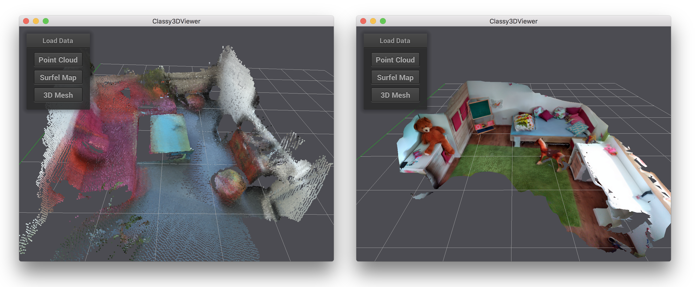

# Classy3DViewer
Simple and classy 3D viewer and 2D renderer for point clouds, surfel maps or meshes



### Build:
```
mkdir build && cd build
cmake -DCMAKE_BUILD_TYPE=Release ..
make
```

Notes: 
An example 3D mesh, point cloud and surfel map can be found in the [data](https://github.com/WaldJohannaU/Classy3DViewer/tree/master/data) folder. Point Clouds and surfel maps are loaded with [tinyply](https://github.com/ddiakopoulos/tinyply).
